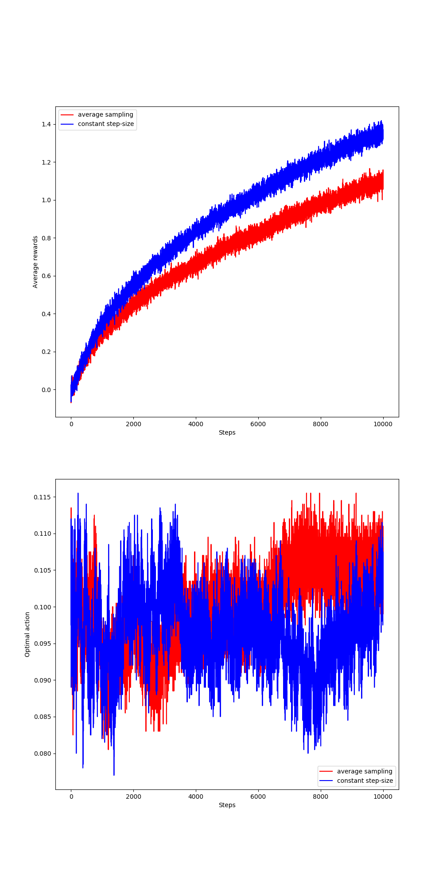
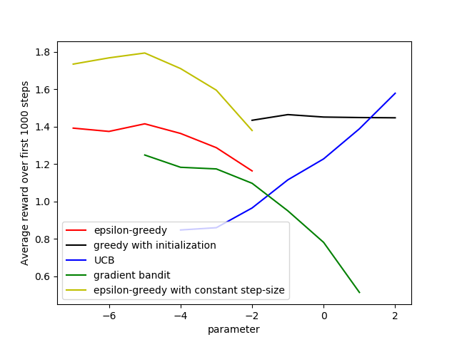

# Chap 2 Multi-armed Bandits (Exercises)

> Codes for **exercises** of chapter 2 in Sutton & Barto's[Reinforcement Learning: An Introduction (2nd Edition)](http://incompleteideas.net/book/the-book.html)

## Exercises 2.5

> Exercise 2.5 (programming) Design and conduct an experiment to demonstrate the
> diculties that sample-average methods have for nonstationary problems. Use a modified
> version of the 10-armed testbed in which all the $q_*(a)$ start out equal and then take
> independent random walks (say by adding a normally distributed increment with mean
> zero and standard deviation 0.01 to all the$q_*(a)$ on each step). Prepare plots like
> Figure 2.2 for an action-value method using sample averages, incrementally computed,
> and another action-value method using a constant step-size parameter, $\alpha$ = 0.1. Use
> $\epsilon$ = 0.1 and longer runs, say of 10,000 steps.

## Exercises 2.11

> Exercise 2.11 (programming) Make a figure analogous to Figure 2.6 for the nonstationary
> case outlined in Exercise 2.5. Include the constant-step-size $\epsilon$-greedy algorithm with
> $\alpha$=0.1. Use runs of 200,000 steps and, as a performance measure for each algorithm and
> parameter setting, use the average reward over the last 100,000 steps.

The **200,000** steps will take too much time, therefore I only run **20,000** steps. 

> Feel free to discuss with me if you have any questions !【Homepage: http://guohai.tech  Email: xuguohai7@163.com】