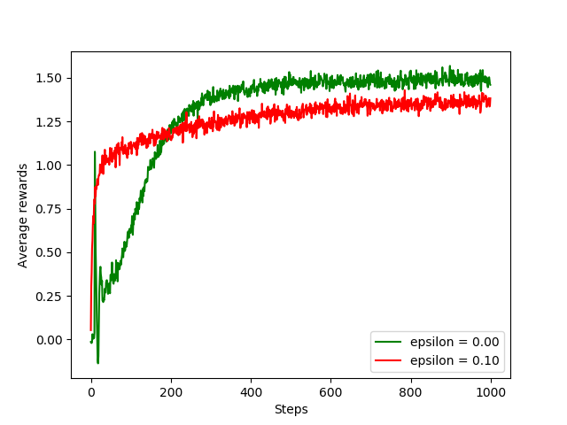

# Chap 2 Multi-armed Bandits (Figures)

> Codes for **figures** of chapter 2 in Sutton & Barto's [Reinforcement Learning: An Introduction (2nd Edition)](http://incompleteideas.net/book/the-book.html)

## Figure 2.1: An example bandit problem from the 10-armed testbed.

## Figure 2.2: Average performance of epsilon-greedy action-value methods on the 10-armed testbed.

## Figure 2.3: The effect of optimistic initial action-value estimates on the 10-armed testbed.

## Figure 2.4: Average performance of UCB action selection on the 10-armed testbed.

## Figure 2.5: Average performance of the gradient bandit algorithm.

## Figure 2.6: A parameter study of the various bandit algorithms.

> Feel free to discuss with me if you have any questions！【Homepage：https://guohai93.github.io  Email：xuguohai7@163.com】

