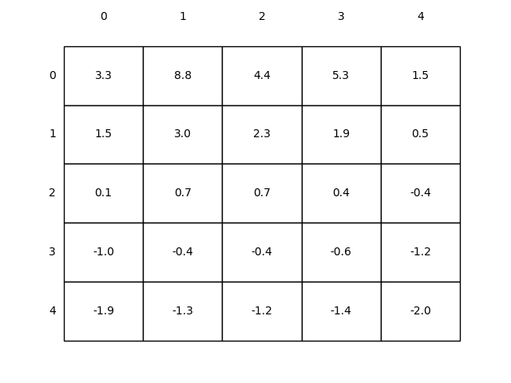
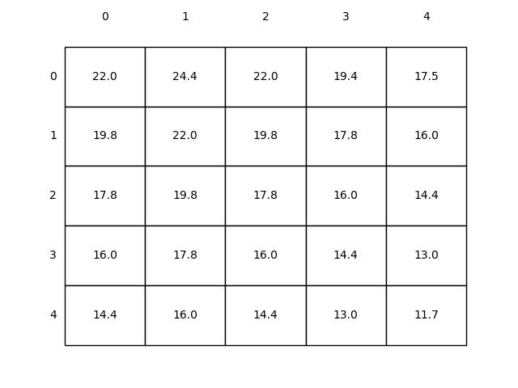

# Chap 3 Finite Markow Decision Processes

> Codes for **figures** of chapter 3 in Sutton & Barto's [Reinforcement Learning: An Introduction (2nd Edition)](http://incompleteideas.net/book/the-book.html)

## Figure 3.2: Gridworld example.

## Figure 3.5: Optimal solutions to the gridworld example.

> Feel free to discuss with me if you have any questions !【Homepage: http://guohai.tech  Email: xuguohai7@163.com】

